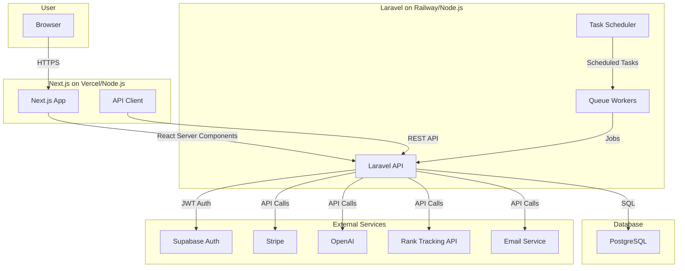

# SEO Norge - System Architecture

This document provides a high-level overview of the technical architecture for the SEO Norge SaaS application. It is intended for developers who will be working on, extending, or evaluating the codebase.

## Guiding Principles

The architecture was designed with the following principles in mind:

- **Scalability**: To handle a growing number of users and data processing tasks.
- **Maintainability**: To make the codebase easy to understand, debug, and extend.
- **Separation of Concerns**: To decouple the frontend, backend, and external services.
- **Developer Experience**: To provide a smooth and efficient local development setup.
- **Sellability**: To create a clean, professional, and well-documented project that can be easily sold and transferred.

## Core Technologies

| Layer | Technology | Reason |
|:---|:---|:---|
| **Frontend** | Next.js 14 (React) + TypeScript | SSR/SSG for SEO, excellent performance, strong typing. |
| **Backend** | Laravel 11 (PHP) | Robust, secure, and mature framework for building APIs. |
| **Database** | PostgreSQL | Powerful, reliable, and open-source relational database. |
| **UI** | Tailwind CSS + shadcn/ui | Utility-first CSS for rapid, consistent UI development. |
| **Authentication** | Supabase Auth | Secure, managed authentication service with RLS. |
| **Deployment** | Docker | Containerization for consistent environments and easy deployment. |

## High-Level Architecture Diagram

## Component Breakdown

### 1. Frontend (Next.js)

- **Location**: `/frontend`
- **Description**: A modern React application responsible for all user-facing interfaces.
- **Key Directories**:
    - `app/`: App Router for routing and layouts. Pages are grouped by functionality (e.g., `(dashboard)`, `(auth)`).
    - `components/`: Reusable React components, organized by `ui` (generic), `layout`, and feature-specific folders.
    - `lib/`: Core client-side logic, including the API client (`api.ts`), Supabase client, and utility functions (`utils.ts`).
    - `hooks/`: Custom React hooks for shared logic (e.g., `use-auth`, `use-api`).
    - `config/`: Centralized frontend configuration.
    - `types/`: Shared TypeScript type definitions.
    - `styles/`: Global styles and the Design System (`design-system.ts`).

### 2. Backend (Laravel)

- **Location**: `/backend`
- **Description**: A RESTful API that handles all business logic, data processing, and communication with external services.
- **Key Directories**:
    - `app/Http/Controllers/Api/`: Handles incoming API requests, validates data, and returns JSON responses.
    - `app/Models/`: Eloquent models for interacting with the PostgreSQL database.
    - `app/Services/`: Contains business logic decoupled from controllers (e.g., `RankTrackerService`, `AiService`).
    - `app/Jobs/`: Asynchronous jobs that are pushed to a queue for background processing (e.g., `CheckKeywordRanking`).
    - `database/migrations/`: Database schema definitions.
    - `routes/api.php`: Defines all API endpoints and applies middleware.

### 3. Authentication (Supabase)

- **Flow**: 
    1. User signs up/in via the Next.js frontend.
    2. Supabase Auth handles the authentication and issues a JWT.
    3. The JWT is sent with every API request to the Laravel backend.
    4. A Laravel middleware (`SupabaseAuth.php`) verifies the JWT with Supabase's public key.
    5. The middleware creates or retrieves the corresponding user from the local PostgreSQL database, linking them by the Supabase user ID.
- **Benefit**: This decouples authentication from the application, providing a secure, managed solution while still maintaining a local user record for relational data.

### 4. Database (PostgreSQL)

- **Description**: The single source of truth for all application data (users, domains, keywords, rankings, etc.).
- **Interaction**: The Laravel backend interacts with the database exclusively through Eloquent models.

### 5. Background Jobs & Queues

- **Technology**: Laravel Queues, potentially backed by Redis.
- **Purpose**: To handle long-running tasks without blocking API responses. This is crucial for:
    - **Rank Tracking**: Scraping Google for keyword positions.
    - **AI Analysis**: Calling the OpenAI API.
    - **Sending Emails**: Welcome emails, reports, etc.
- **Flow**:
    1. An API controller dispatches a Job (e.g., `CheckKeywordRanking`).
    2. The Job is pushed to a queue.
    3. A separate queue worker process picks up the Job and executes it.

### 6. Deployment (Docker)

- **File**: `docker-compose.yml`
- **Services**:
    - `frontend`: Node.js container for the Next.js app.
    - `backend`: PHP-FPM + Nginx container for the Laravel app.
    - `db`: PostgreSQL database container.
    - `redis`: (Optional) Redis container for queues.
- **Benefit**: Provides a consistent, reproducible environment for both local development and production deployment, making the project highly portable.

## Data Flow Example: Adding a Keyword

1. **User** clicks "Add Keyword" in the Next.js frontend.
2. **Frontend** calls the `keywordsApi.create()` function in `lib/api.ts`.
3. **API Client** sends a `POST` request to `/api/domains/{id}/keywords`.
4. **Laravel Router** directs the request to `KeywordController@store`.
5. **Controller** validates the input.
6. **Controller** creates a new `Keyword` model and saves it to the **PostgreSQL database**.
7. **Controller** dispatches the `CheckKeywordRanking` job to the **queue**.
8. **Controller** returns a `201 Created` response with the new keyword data.
9. **Frontend** receives the response and updates the UI.
10. A **Queue Worker** process picks up the `CheckKeywordRanking` job, calls the **Rank Tracking API**, and updates the `rankings` table in the database.

This architecture ensures a robust, scalable, and maintainable foundation for the SEO Norge SaaS application, making it an ideal template for a professional SaaS product.
